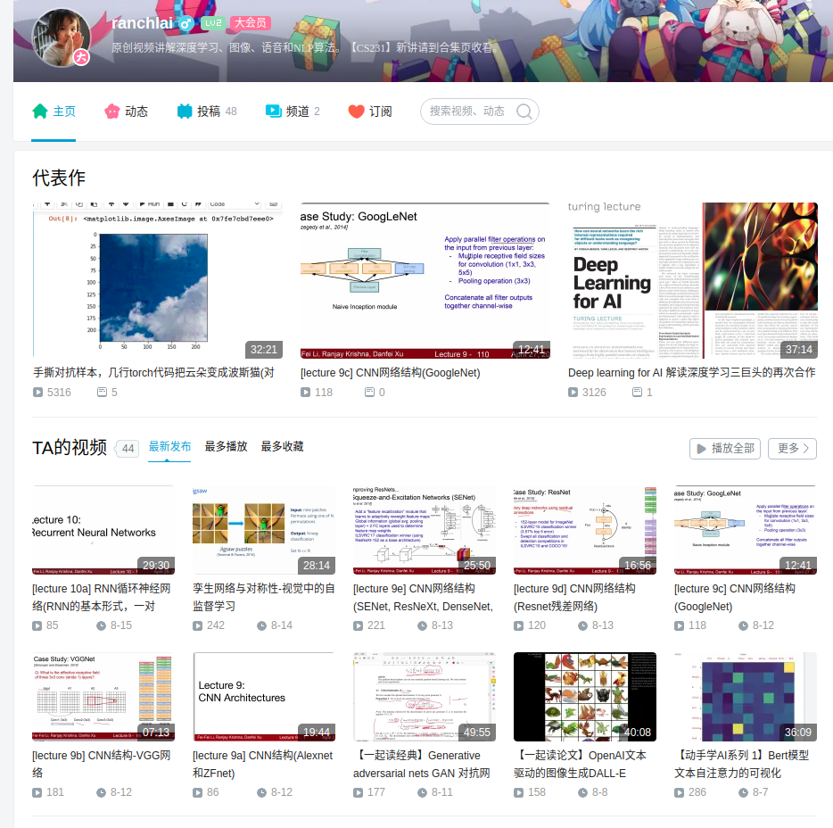

# LECTURE SERIES IN DEEP LEARNING
我在B站的一些视频资料汇总. Github随时更新, 请点击收藏.

## NEWS
- 2023-06-10 新增LoRA论文和代码讲解 [B站视频1](https://www.bilibili.com/video/BV1nk4y1p742/), [B站视频2](https://www.bilibili.com/video/BV1CX4y1t7qX), [B站视频3]()
代码已更新到[github](./code/lora/)

## 论文解读系列
### 视觉(CV)
- OpenAI文本驱动的图像生成DALL-E (DALLE) [B站视频](https://www.bilibili.com/video/BV16U4y1J7RQ)
- DETR让检测变得更简单，基于transformer的端到端目标检测 [B站视频](https://www.bilibili.com/video/BV15q4y1Q75R)
- VQGAN(CVPR2021)解读 [中文]: Taming Transformers for High-Resolution Image Synthesis [B站视频](https://www.bilibili.com/video/BV1My4y1j7f2)
- 中文解读CVPR 2021最佳论文 GIRAFFE: 组合生成式神经特征场用于场景表示 [B站视频](https://www.bilibili.com/video/BV1hy4y1T7eY)
-  Vision Transformer(ViT): An Image is Worth 16x16 Words [B站视频](https://www.bilibili.com/video/BV1HU4y137JH)
### 语音
- [语音] Conformer asr 谷歌语音识别论文解读 Interspeech 2020 [B站视频](https://www.bilibili.com/video/BV1yb4y1679X)
- 语音自监督学习之wav2vec系统论文解读（中文）CPC, wav2vec, vq-wav2vec, wav2vec2.0 [B站视频](https://www.bilibili.com/video/BV16M4y1M7FR)
### NLP
- self-attention自注意力机制图解和Numpy简单演示 [code](TBD) | [B站视频](https://www.bilibili.com/video/BV1Kv411J7rj)
- 傅立叶变换网络 FNet: Mixing Tokens with Fourier Transforms [B站视频](https://www.bilibili.com/video/BV1Lf4y1j72Z)
### 对抗学习, 通用深度学习技术
- Generative adversarial nets GAN 对抗网络的开山之作 [B站视频](https://www.bilibili.com/video/BV12y4y1L78v)
- 通过代码理解BatchNorm，LayerNorm， InstanceNorm和GroupNorm归一化方式。 [B站视频](https://www.bilibili.com/video/BV1nU4y1J7ix)
- 手撕对抗样本，几行torch代码把云朵变成波斯猫(对抗网络入门必看) [code](TBD) | [B站视频](https://www.bilibili.com/video/BV1b54y177NW)
- Deep learning for AI 解读深度学习三巨头的再次合作 [B站视频](https://www.bilibili.com/video/BV1nv411H7PN)
- Gumbel Softmax补充说明 [B站视频](https://www.bilibili.com/video/BV1Py4y1u7wJ)
- Gumbel-softmax 中文解读 Categorical Reparameterization with Gumbel-Softmax [B站视频](https://www.bilibili.com/video/BV1G64y1b7v3)
- VQ-VAE: Neural Discrete Representation Learning [B站视频](https://www.bilibili.com/video/BV1Mv411H7NZ)

### 自监督学习系列
- 孪生网络与对称性-视觉中的自监督学习| [PPT](./doc/self_superivse_in_vision.pdf)|[B站视频](https://www.bilibili.com/video/BV1jq4y1H73A/)
- 自监督学习：智能时代的暗物质 Self-supervised learning: The dark matter of intelligence文章解读 [B站视频](https://www.bilibili.com/video/BV1fy4y1K7EW)
- OpenAI CLIP文本图像自监督学习解读 Learning Transferable Visual Models From Natural Language [B站视频](https://www.bilibili.com/video/BV1Vf4y1b724)
## 动手学AI系列
- 【动手学AI系列 1】Bert模型文本自注意力的可视化 [code](./code/rnn/rnn_demo.ipynb)|[B站视频](https://www.bilibili.com/video/BV1nA411P7R8/)
- 【动手学AI系列 2】AI写作文 / 对着图手撕RNN  [code](./code/rnn/rnn_demo.ipynb)|[B站视频](https://www.bilibili.com/video/BV1H64y1e729/)

## CS231N系列
- 合集地址 [电脑版点击这里](https://space.bilibili.com/354943571/channel/detail?cid=192055&ctype=0) 手机版请进入[合集页](https://space.bilibili.com/354943571?spm_id_from=333.788.b_765f7570696e666f.2)收看
- PPT 请从[官方下载](http://cs231n.stanford.edu/schedule.html)

## 更多信息, 请点击图片前往B站主页

